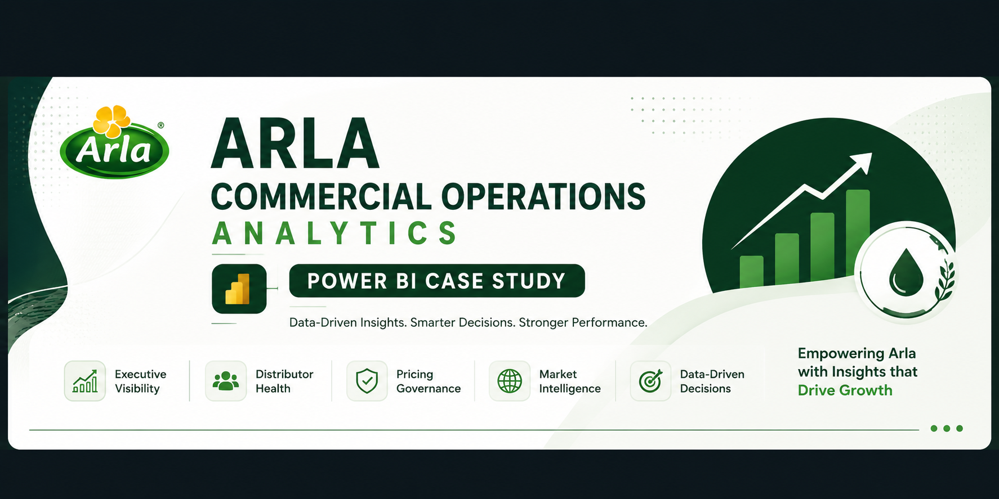
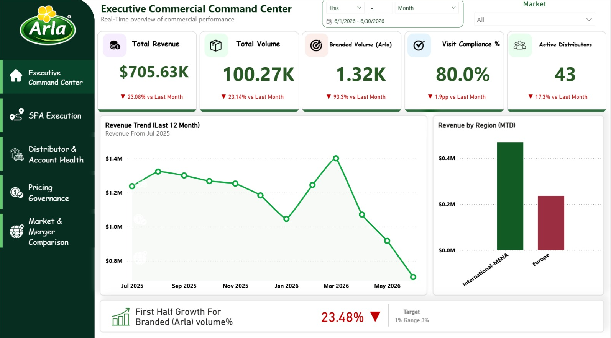
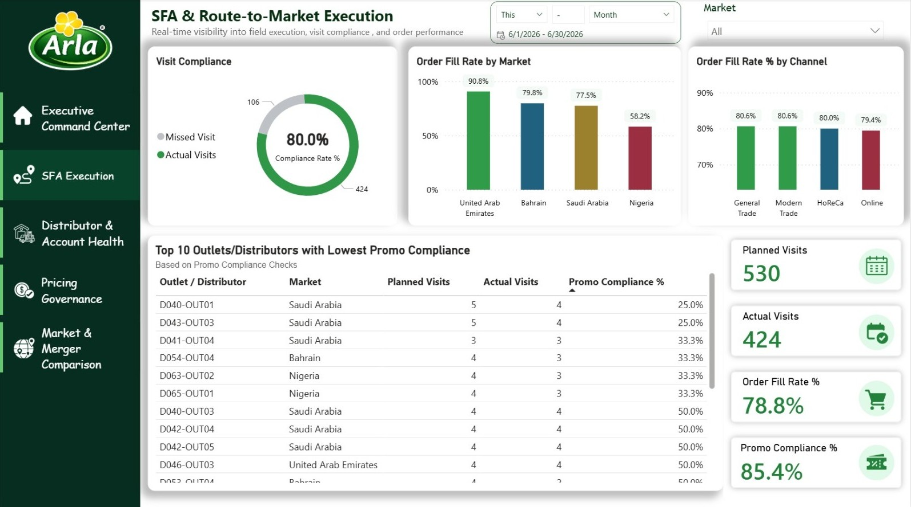
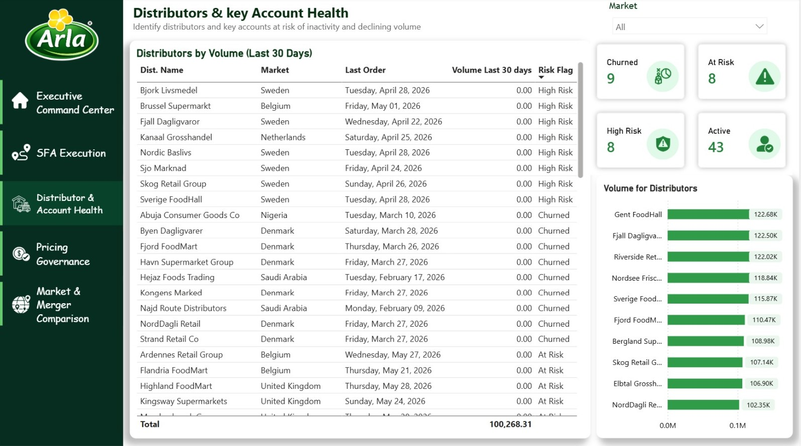
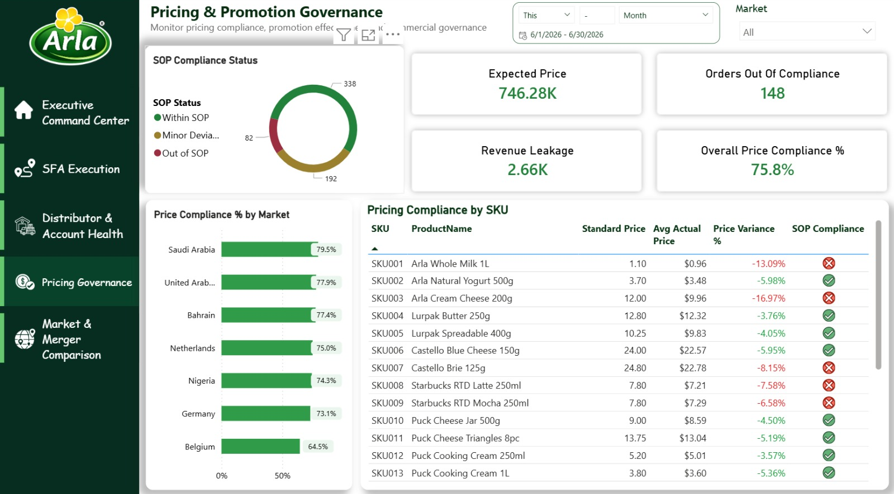
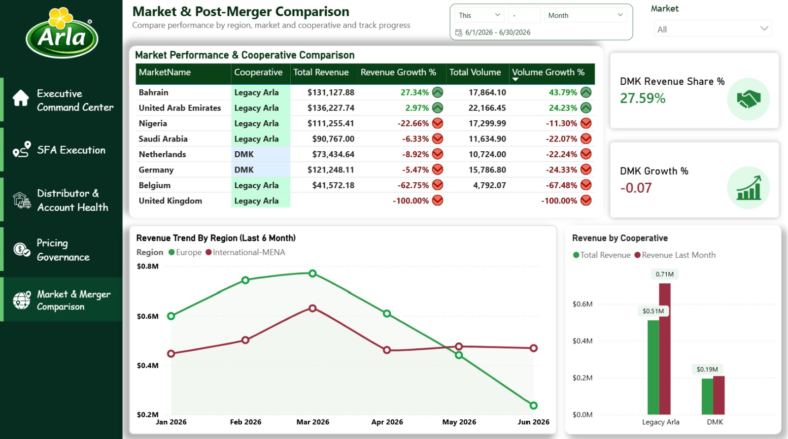

# 🥛 Arla Commercial Operations Analytics | Power BI Case Study

> An end-to-end Business Intelligence case study built in Power BI to simulate commercial operations reporting for **Arla Foods**. The project provides executive visibility into commercial performance, sales execution, distributor health, pricing governance, and post-merger business performance through interactive dashboards and business-driven KPIs.

---

# 📌 Project Overview

This project was developed as a **real-world Business Intelligence case study** inspired by the responsibilities of a Commercial Operations & Business Analyst.

The dashboard enables business users to monitor commercial performance, evaluate field execution, identify distributor risks, enforce pricing governance, and compare regional performance after the Arla–DMK merger.

The objective is not only to visualize data, but to answer real business questions that support operational and strategic decision-making.

---

## 📑 Project Documentation

- 📄 **Business Case Study:** [Commercial_Operations_Case_Study](https://app.notion.com/p/Arla-Foods-398f3442875c80578910c50545f5de33?source=copy_link)

---

---

# 🎯 Business Objectives

The dashboard was designed to answer the following business questions:

### Executive Dashboard
- How is commercial performance changing over time?
- Are revenue and volume growing?
- Are branded products achieving their growth targets?
- Are field visits executed as planned?

### Sales Force Execution
- Which markets have the highest Order Fill Rate?
- Are sales representatives completing planned visits?
- Which channels perform best?
- Which outlets have poor promotional execution?

### Distributor Health
- Which distributors are at risk of churn?
- Which key accounts have stopped ordering?
- Which distributors generate the highest volume?

### Pricing & Promotion Governance
- Which products violate approved pricing?
- What percentage of orders comply with pricing policies?
- Where is revenue leakage occurring?

### Market & Post-Merger Analysis
- Which region generates the highest revenue?
- How does Legacy Arla compare with DMK?
- Which markets are declining?
- Is post-merger performance improving?

---

# 🛠 Tech Stack

- Power BI Desktop
- Power Query
- DAX
- Star Schema Data Modeling
- Excel
- Business Intelligence
- Data Visualization

---

# 📂 Dataset

The project uses a simulated commercial operations dataset consisting of multiple business entities:

- Orders
- Products
- Calendar
- Markets
- Distributors
- SFA Visits

The dataset was designed to simulate commercial reporting for a multinational FMCG company.

---

# ⭐ Dashboard Pages

## 1️⃣ Executive Commercial Command Center

Provides a high-level overview of commercial performance.

### KPIs

- Revenue
- Total Volume
- Branded Volume
- Visit Compliance
- Active Distributors

### Visuals

- Revenue Trend (12 Months)
- Revenue by Region
- Branded Growth KPI

---

## 2️⃣ SFA & Route-to-Market Execution

Monitors field execution and sales force performance.

### KPIs

- Planned Visits
- Actual Visits
- Order Fill Rate
- Promo Compliance

### Visuals

- Visit Compliance
- Order Fill Rate by Market
- Order Fill Rate by Channel
- Lowest Promo Compliance Accounts

---

## 3️⃣ Distributor & Key Account Health

Monitors distributor activity and identifies accounts at risk.

### KPIs

- Churned Distributors
- High Risk Accounts
- At Risk Accounts
- Active Distributors

### Visuals

- Distributor Health Table
- Top Distributors by Volume

---

## 4️⃣ Pricing & Promotion Governance

Evaluates pricing compliance and commercial governance.

### KPIs

- Overall Price Compliance
- Orders Out of Compliance
- Expected Price
- Revenue Leakage

### Visuals

- SOP Compliance Distribution
- Price Compliance by Market
- SKU Pricing Compliance Table

---

## 5️⃣ Market & Post-Merger Comparison

Compares regional performance and tracks post-merger progress.

### KPIs

- DMK Revenue Share
- DMK Growth

### Visuals

- Revenue Trend by Region
- Revenue by Cooperative
- Market Performance Table

---

# 📈 Key Business Insights

The dashboard generated several business insights across commercial performance, sales execution, distributor health, pricing governance, and market performance.

> **Arabic Business Insights:** [Insights-Arabic.md](Insights-Arabic.md)

### Executive

- Revenue decreased by **23.1%** compared to the previous month.
- Total Volume declined by **23.1%**.
- Branded Volume experienced the largest decline (**-93.3%**), highlighting a significant slowdown in Arla branded products.
- Visit Compliance decreased by **1.9 percentage points**, indicating a slight decline in field execution.
- International-MENA generated higher revenue than Europe during the selected period.

---

### Sales Force Execution

- UAE achieved the highest Order Fill Rate.
- Nigeria recorded the lowest operational performance.
- Sales channels performed consistently with no major execution gaps.
- Several outlets showed low promotional compliance, requiring additional follow-up.

---

### Distributor Health

- Multiple distributors were identified as Churned, High Risk, or At Risk.
- Several previously high-performing distributors recorded no sales during the last 30 days.
- Risk segmentation helps prioritize sales efforts toward accounts requiring immediate attention.

---

### Pricing Governance

- Approximately one quarter of orders did not fully comply with pricing policies.
- Multiple products were sold below their approved standard price.
- Revenue leakage opportunities were identified through pricing variance analysis.

---

### Market Performance

- Legacy Arla remains the largest revenue contributor.
- DMK currently contributes approximately 28% of total revenue.
- Several markets experienced declining growth.
- Europe showed a downward revenue trend during the latest months.

---

# 📷 Dashboard Preview

Executive Commercial Command Center

---

SFA & Route-to-Market Execution

---

Distributor & Key Account Health

---

Pricing & Promotion Governance

---

Market & Post-Merger Comparison

---

# 👤 Author

**Mohammed Hesham**

Junior Business Intelligence & Data Analyst
